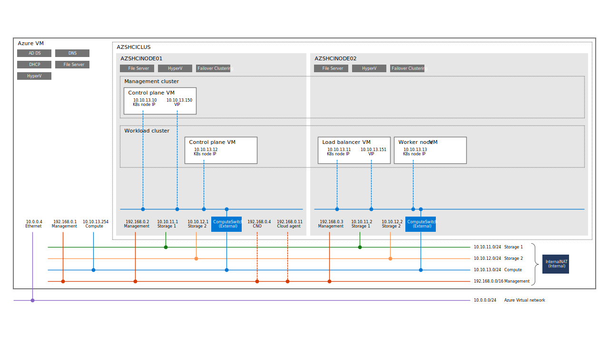

# AKS on Azure Stack HCI 21H2



## Azure Stack HCI クラスターの作成

[Azure Stack HCI 21H2 - Evaluation Guide](https://github.com/Azure/AzureStackHCI-EvalGuide/tree/21H2) に従って Azure Stack HCI クラスターを作成します。**main** ブランチではなく、**21H2** ブランチを使用します。

### Part 1 - Complete the prerequisites - deploy your Azure VM

[Deploy your Azure VM (Prerequisite)](https://github.com/Azure/AzureStackHCI-EvalGuide/blob/21H2/deployment/steps/1_DeployAzureVM.md) を参考にして Azure VM (Hyper-V ホスト) をデプロイします。

1. カスタム ARM テンプレートを使用してデプロイします。デプロイに要する時間は **35 分程度**です。

    - 稀にデプロイが失敗します。失敗した場合は、失敗したリソース グループを削除しつつ、再デプロイします。多くても 2 ～ 3 回目で大概成功します。
        - 失敗する理由は様々なので、エラー内容を確認した上で、再デプロイする必要があります。例えば、vCore のクォータ不足でエラーになっている場合、何度再デプロイしても同じエラーで失敗します。

    - Virtual Machine Size: **Standard_E16s_v4**
        - VM サイズは Standard_E16s_v4 が事実上の最低サイズです。これ以上小さいサイズを選択した場合、環境は作れたとしてもその後の検証がほぼ何もできません。
    - Data Disk Size: **64**
        - データ ディスク サイズは 64 GB x 8 ディスク (512 GB) を選択します。
        - 32 GB x 8 ディスク (256 GB) ではディスク容量が不足しやすいです。
            - Azure VM 停止時の AKS VM の保存容量、HCI ノード VM のメモリを増やした場合の VMRS ファイルのサイズなど、VHDX のサイズ以外にもディスク容量が必要になります。ディスク容量が不足すると VMRS ファイルを作成できず、VM を起動できません。
            - Azure VM のディスクは Simple 構成の記憶域スペースなので、後から容量を増やすのは難しいです。
    - Enable DHCP: **Disabled**
        - 今回は DHCP は使用しません。

2. デプロイ完了後にやっておいた方が良いことがいくつかあります。

    1. NSG の RDP のセキュリティ規則を更新します。

        - デプロイされる NSG ではインターネットからの RDP 接続を無制限で許可しています。これは望ましくありませんので、Just-in-time VM access を有効化したり、特定の IP アドレスからの接続のみを許可するセキュリティ規則に変更するなどすることをお勧めします。

    2. Azure VM (Hyper-V ホスト) に RDP 接続して Azure VM (Hyper-V ホスト) にすべての更新プログラムを適用します。

        - AKS on HCI の構成し始めてから更新プログラムが適用されて再起動が発生してしまうことを避けられます。
        - コストを節約するために既定では OS ディスクは Standard HDD LRS となっていて、更新プログラムの適用にはある程度の時間を要する場合があります。

    3. 必要に応じて、Azure VM のパブリック IP アドレスに割り当てられている DNS 名を変更しておきます。

        - 複数環境をデプロイしている場合に見分けが難しくなりやすいので、リソース グループ名を追加するなどしておくと便利です。

3. Azure VM (Hyper-V ホスト) 上の HCI ノード VM の RAM サイズを可能な範囲で増やしておきます。

    - Standard_E16s_v4 で 2 ノード クラスターなら、**57344 MB** 程度に増やしておくのが良いです。
        - 56 GB = (HCI ノード VM RAM: 128 GB - Hyper-V ホスト分: 16 GB) / 2 ノード。
        - VMRS ファイル サイズは 2 ノード分で 112 GB です。

### Part 2 - Configure your Azure Stack HCI 21H2 Cluster

[Configure your Azure Stack HCI 21H2 Cluster](https://github.com/Azure/AzureStackHCI-EvalGuide/blob/21H2/deployment/steps/2_DeployAzSHCI.md) を参考にして Azure Stack HCI クラスターを作成します。

1. ホスト ネットワークを構成します。

    - **One physical network adapter for management** を選択します。

        - azshcinode**01**.azshci.local

            | MAC アドレス | 名前 | IP アドレス | サブネット マスク | 説明 |
            | ---- | ---- | ---- | ---- | ---- |
            | 00-15-5D-00-04-**01** | Management<br/>(変更前の時点では Ethernet N) | 192.168.0.2 | 16 | 管理トラフィック用 |

        - azshcinode**02**.azshci.local

            | MAC アドレス | 名前 | IP アドレス | サブネット マスク | 説明 |
            | ---- | ---- | ---- | ---- | ---- |
            | 00-15-5D-00-04-**05** | Management<br/>(変更前の時点では Ethernet N) | 192.168.0.3 | 16 | 管理トラフィック用 |

    - **Create one virtual switch for compute only** を選択します。

        - azshcinode**01**.azshci.local
            - 10.10.**13**.1 の IP アドレスを持ったネットワーク アダプターを選択します。

        - azshcinode**02**.azshci.local
            - 10.10.**13**.2 の IP アドレスを持ったネットワーク アダプターを選択します。

    - 最終的なストレージ トラフィック用とコンピューティング トラフィック用ネットワーク アダプターの構成

        - azshcinode**01**.azshci.local

            | MAC アドレス | 名前 | IP アドレス | サブネット マスク | 説明 |
            | ---- | ---- | ---- | ---- | ---- |
            | 00-15-5D-00-04-**02** | Storage 1 | 10.10.11.1 | 24 | ストレージ トラフィック用 1 |
            | 00-15-5D-00-04-**03** | Storage 2 | 10.10.12.1 | 24 | ストレージ トラフィック用 2 |
            | 00-15-5D-00-04-**04** | Compute | 10.10.13.1 | 24 | コンピューティング トラフィック用 |

        - azshcinode**02**.azshci.local

            | MAC アドレス | 名前 | IP アドレス | サブネット マスク | 説明 |
            | ---- | ---- | ---- | ---- | ---- |
            | 00-15-5D-00-04-**06** | Storage 1 | 10.10.11.2 | 24 | ストレージ トラフィック用 1 |
            | 00-15-5D-00-04-**07** | Storage 2 | 10.10.12.2 | 24 | ストレージ トラフィック用 2 |
            | 00-15-5D-00-04-**08** | Compute | 10.10.13.2 | 24 | コンピューティング トラフィック用 |

2. クラスターを作成します。

    - クラスター名: **AZSHCICLUS**
    - クラスター IP: **192.168.0.4**

3. Storage Spaces Direct を有効化します。

4. クラウド監視を構成します。

    [Azure Cloud Shell](https://shell.azure.com/) などを使用してクラウド監視用のストレージ アカウントを作成し、そのストレージ アカウントを使用して Azure Stack HCI クラスターの監視を構成します。

    ストレージ アカウントの作成例:

    ```powershell
    $params = @{
        Name                   = 'azshciwitness0{0}' -f (-join ((48..57) + (97..122) | Get-Random -Count 4 |% {[char]$_}))
        ResourceGroupName      = 'aksazshci'
        Location               = 'japaneast'
        SkuName                = 'Standard_LRS'
        Kind                   = 'StorageV2'
        EnableHttpsTrafficOnly = $true
        MinimumTlsVersion      = 'TLS1_2'
        AllowBlobPublicAccess  = $false
    }
    $sa = New-AzStorageAccount @params

    $sa.Context | Format-List -Property StorageAccountName,@{ Name = 'Endpoint'; Expression = { $_.EndpointSuffix.Trim('/') } }
    $sa | Get-AzStorageAccountKey
    ```

### Part 3 - Integrate Azure Stack HCI 21H2 with Azure

[Integrate Azure Stack HCI 21H2 with Azure](https://github.com/Azure/AzureStackHCI-EvalGuide/blob/21H2/deployment/steps/3_AzSHCIIntegration.md) を参考にして Azure Stack HCI クラスターを Azure に登録します。

1. [Azure Cloud Shell](https://shell.azure.com/) などを使用して Azure サブスクリプションに Microsoft.AzureStackHCI リソース プロバイダーを登録します。

    自動で登録されるはずですが、初回失敗することが多いので、あらかじめ登録しておきます。

    ```powershell
    Register-AzResourceProvider -ProviderNamespace 'Microsoft.AzureStackHCI'
    ```

    すべてのリソース タイプの RegistrationState が Registered になっている場合は、再度登録する必要はありません。なお、登録してある状態で再度 Register-AzResourceProvider コマンドレットを実行したとしても影響はありません。

    ```powershell
    PS C:\> Get-AzResourceProvider -ProviderNamespace 'Microsoft.AzureStackHCI'

    ProviderNamespace : Microsoft.AzureStackHCI
    RegistrationState : Registered
    ResourceTypes     : {operations}
    Locations         : {}

    ProviderNamespace : Microsoft.AzureStackHCI
    RegistrationState : Registered
    ResourceTypes     : {locations}
    Locations         : {}

    ProviderNamespace : Microsoft.AzureStackHCI
    RegistrationState : Registered
    ResourceTypes     : {locations/operationstatuses}
    Locations         : {East US, East US 2 EUAP, West Europe, Southeast Asia…}
    ...(省略)..
    ```

2. Hyper-V ホスト上 (Azure VM 上) に必要な PowerShell モジュールをインストールします。

    ```powershell
    Install-PackageProvider -Name 'NuGet' -Scope AllUsers -Force -Verbose
    Install-Module -Name 'PowerShellGet' -Scope AllUsers -Force -Verbose
    ```

    インストールした PowerShell モジュールが確実に読み込まれるように PowerShell を閉じて起動し直した後で Az.StackHCI モジュールをインストールします。

    ```powershell
    Install-Module -Name 'Az.StackHCI' -Scope AllUsers -Force -Verbose
    ```

3. インストールした PowerShell モジュールが確実に読み込まれるように PowerShell を開き直しておきます。

4. Azure Stack HCI クラスターを Azure に登録します。2 ノードの場合、登録に要する時間は **10 分程度**です。

    ```powershell
    $clusterName             = 'azshciclus'                 # The Azure Stack HCI cluster name. The evaluation guide uses this name.
    $computerName            = 'azshcinode01.azshci.local'  # The node name that one of the cluster nodes in the Azure Stack HCI cluster.
    $credential              = Get-Credential -UserName 'azshci\AzureUser' -Message 'Enter the password'

    $tenantId                = '00000000-1111-2222-3333-444444444444'
    $subscriptionId          = '55555555-6666-7777-8888-999999999999'
    $azshciResourceGroupName = 'aksazshci'
    $azshciRegion            = 'SoutheastAsia'
    $azshciResourceName      = '{0}-{1}-{2}' -f $clusterName, $azshciResourceGroupName, (Get-Date).ToString('yyMMdd-HHmm')
    $arcResourceGroupName    = '{0}-arc' -f $azshciResourceGroupName

    $params = @{
        ComputerName               = $computerName             # The cluster name or one of the cluster node name in the cluster that is being registered to Azure.
        Credential                 = $credential               # The credential for the ComputerName. Use the password specified during Azure VM deployment.

        TenantId                   = $tenantId                 # The Azure AD tenant that associated with Azure subscription to create the Azure Stack HCI resource.
        SubscriptionId             = $subscriptionId           # The Azure subscription to create the Azure Stack HCI resource.
        ResourceGroupName          = $azshciResourceGroupName  # The resource group to create the Azure Stack HCI resource.
        Region                     = $azshciRegion             # The region to create the Azure Stack HCI resource. Be sure to specify the supported region. https://docs.microsoft.com/en-us/azure-stack/hci/deploy/register-with-azure
        ResourceName               = $azshciResourceName       # The resource name of the Azure Stack HCI resource. The default value is the cluster name.

        EnableAzureArcServer       = $true                     # Set $true if want to register Azure Stack HCI cluster as Azure Arc-enabled server.
        ArcServerResourceGroupName = $arcResourceGroupName     # The resource group to create the Arc resource of Azure Stack HCI nodes.

        Verbose                    = $true
    }
    Register-AzStackHCI @params
    ```

5. Azure Stack HCI クラスターの登録状態を確認します。

    ```powershell
    Invoke-Command -ComputerName 'azshcinode01.azshci.local' -ScriptBlock {
        Get-AzureStackHCI
    }
    ```

    登録状態を確認した結果の例:

    ```powershell
    PS C:\> Invoke-Command -ComputerName 'azshcinode01.azshci.local' -ScriptBlock {
    >>     Get-AzureStackHCI
    >> }

    PSComputerName     : azshcinode01.azshci.local
    RunspaceId         : 791b714b-ba27-4b84-aa2e-dc62c59f7d3c
    ClusterStatus      : Clustered
    RegistrationStatus : Registered
    RegistrationDate   : 7/15/2022 4:53:08 AM
    AzureResourceName  : azshciclus-aksazshci4-220715-0448
    AzureResourceUri   : /Subscriptions/55555555-6666-7777-8888-999999999999/resourceGroups/aksazshci/providers/Microsoft.AzureStackHCI/clusters/azshciclus-aksazshci-220715-0448
    ConnectionStatus   : Connected
    LastConnected      : 7/15/2022 4:57:18 AM
    IMDSAttestation    : Disabled
    DiagnosticLevel    : Basic
    ```

参考情報:

- [Connect and manage Azure Stack HCI registration](https://docs.microsoft.com/en-us/azure-stack/hci/deploy/register-with-azure)


## AKS on HCI を構成するための準備 - Azure サブスクリプション

[Azure Cloud Shell](https://shell.azure.com/) などを使用して Azure サブスクリプションにリソース プロバイダーを登録します。

```powershell
Register-AzResourceProvider -ProviderNamespace 'Microsoft.Kubernetes'
Register-AzResourceProvider -ProviderNamespace 'Microsoft.KubernetesConfiguration'
Register-AzResourceProvider -ProviderNamespace 'Microsoft.ExtendedLocation'
```

すべてのリソース タイプの RegistrationState が Registered になっている場合は、再度登録する必要はありません。なお、登録してある状態で再度 Register-AzResourceProvider コマンドレットを実行したとしても影響はありません。

```powershell
PS C:\> Get-AzResourceProvider -ProviderNamespace 'Microsoft.Kubernetes','Microsoft.KubernetesConfiguration','Microsoft.ExtendedLocation'

ProviderNamespace : Microsoft.Kubernetes
RegistrationState : Registered
ResourceTypes     : {connectedClusters}
Locations         : {West Europe, East US, West Central US, South Central US…}

ProviderNamespace : Microsoft.Kubernetes
RegistrationState : Registered
ResourceTypes     : {locations}
Locations         : {}

ProviderNamespace : Microsoft.Kubernetes
RegistrationState : Registered
ResourceTypes     : {locations/operationStatuses}
Locations         : {East US 2 EUAP, West Europe, East US, West Central US…}
...(省略)..
```

参考情報:

- [Connect an Azure Kubernetes Service on Azure Stack HCI cluster to Azure Arc-enabled Kubernetes](https://docs.microsoft.com/en-us/azure-stack/aks-hci/connect-to-arc)


## AKS on HCI を構成するための準備 - Azure VM (Hyper-V ホスト)

### NAT を構成

Azure VM (Hyper-V ホスト) 上でコンピューティング トラフィック用ネットワークの NAT を構成します。これにより、コンピューティング トラフィック用ネットワークに接続した VM をインターネット接続可能なように構成できるようになります。

```powershell
Get-NetAdapter -Name '*InternalNAT*' | New-NetIPAddress -AddressFamily IPv4 -IPAddress 10.10.13.254 -PrefixLength 24
New-NetNat -Name 'AzSHCINAT-Compute' -InternalIPInterfaceAddressPrefix 10.10.13.0/24
```

構成結果を確認

```powershell
Get-NetAdapter -Name '*InternalNAT*' | Get-NetIPAddress | Format-Table -Property InterfaceIndex,InterfaceAlias,IPAddress,PrefixLength,AddressFamily
Get-NetNat | Format-Table -Property Name,InternalIPInterfaceAddressPrefix,Active
```

構成結果の確認例:

```powershell
PS C:\> Get-NetAdapter -Name '*InternalNAT*' | Get-NetIPAddress | Format-Table -Property InterfaceIndex,InterfaceAlias,IPAddress,PrefixLength,AddressFamily

InterfaceIndex InterfaceAlias          IPAddress    PrefixLength AddressFamily
-------------- --------------          ---------    ------------ -------------
             8 vEthernet (InternalNAT) 192.168.0.1            16          IPv4
             8 vEthernet (InternalNAT) 10.10.13.254           24          IPv4

PS C:\> Get-NetNat | Format-Table -Property Name,InternalIPInterfaceAddressPrefix,Active

Name              InternalIPInterfaceAddressPrefix Active
----              -------------------------------- ------
AzSHCINAT         192.168.0.0/16                     True
AzSHCINAT-Compute 10.10.13.0/24                      True
```

## AKS on HCI を構成するための準備 - Azure Stack HCI クラスターと HCI ノード

### AKS on HCI 用 CSV ボリュームの作成

Azure VM (Hyper-V) 上から PowerShell Remoting を使用して Azure Stack HCI クラスター上に新しい AKS on HCI 用 CSV ボリュームを作成します。

```powershell
Invoke-Command -ComputerName 'azshcinode01.azshci.local' -ScriptBlock {
    New-Volume -FriendlyName 'AksHciVol' -StoragePoolFriendlyName 'S2D*' -FileSystem CSVFS_ReFS -UseMaximumSize -ProvisioningType Fixed -ResiliencySettingName Mirror -Verbose
}
```

### HCI ノードへの AksHci PowerShell モジュールのインストール

Azure VM (Hyper-V) 上から PowerShell Remoting を使用して各 Azure Stack HCI クラスター ノード上に AksHci PowerShell モジュールのインストールします。

```powershell
$hciNodes = 'azshcinode01.azshci.local', 'azshcinode02.azshci.local'

Invoke-Command -ComputerName $hciNodes -ScriptBlock {
    Install-PackageProvider -Name 'NuGet' -Scope AllUsers -Force -Verbose
    Install-Module -Name 'PowerShellGet' -Scope AllUsers -Force -Verbose
}

Invoke-Command -ComputerName $hciNodes -ScriptBlock {
    Install-Module -Name 'AksHci' -Repository 'PSGallery' -AcceptLicense -Force -Verbose 
}
```

参考情報:

- [Quickstart: Set up an Azure Kubernetes Service host on Azure Stack HCI and Windows Server and deploy a workload cluster using PowerShell](https://docs.microsoft.com/en-us/azure-stack/aks-hci/kubernetes-walkthrough-powershell)

### HCI ノードの要件の検証

[Initialize-AksHciNode](https://docs.microsoft.com/en-us/azure-stack/aks-hci/reference/ps/initialize-akshcinode) コマンドレットを使用して全ての HCI ノードで要件が満たされているかを確認します。

- [vmconnect.exe](#vmconnectexe) を使用して、各 Azure Stack HCI クラスター ノードにコンソール接続 (または、拡張セッション接続) した上で、Initialize-AksHciNode コマンドレットを実行します。
- ローカル Administrator としての実行で問題ありません。

```powershell
Initialize-AksHciNode
```

実行結果の確認例:

```powershell
PS C:\> Initialize-AksHciNode
WinRM service is already running on this machine.
WinRM is already set up for remote management on this computer.
```

参考情報:

- [Quickstart: Set up an Azure Kubernetes Service host on Azure Stack HCI and Windows Server and deploy a workload cluster using PowerShell](https://docs.microsoft.com/en-us/azure-stack/aks-hci/kubernetes-walkthrough-powershell)


## AKS on HCI (AKS ホスト / 管理クラスター) の作成

- [vmconnect.exe](#vmconnectexe) を使用して、いずれか 1 台の Azure Stack HCI クラスター ノードにコンソール接続 (または、拡張セッション接続) した上で手順を実行します。
- 既定で実行される PowerShell ウィンドウはローカル Administrator として実行されているため、Domain Admin として実行した PowerShell を使用します。

    ```powershell
    runas /user:azshci\AzureUser powershell
    ```

### 管理クラスターで使用する仮想ネットワーク構成を作成

[New-AksHciNetworkSetting](https://docs.microsoft.com/en-us/azure-stack/aks-hci/reference/ps/new-akshcinetworksetting) コマンドレットを使用して管理クラスターで使用する仮想ネットワークの構成を作成します。

```powershell
$params = @{
    Name               = 'akshci-main-network'
    VSwitchName        = 'ComputeSwitch'
    Gateway            = '10.10.13.254'
    DnsServers         = '192.168.0.1'
    IpAddressPrefix    = '10.10.13.0/24'
    K8sNodeIpPoolStart = '10.10.13.11'
    K8sNodeIpPoolEnd   = '10.10.13.20'
    VipPoolStart       = '10.10.13.21'
    VipPoolEnd         = '10.10.13.30'
}
$vnet = New-AksHciNetworkSetting @params
```

参考情報:

- [Quickstart: Set up an Azure Kubernetes Service host on Azure Stack HCI and Windows Server and deploy a workload cluster using PowerShell](https://docs.microsoft.com/en-us/azure-stack/aks-hci/kubernetes-walkthrough-powershell)

### AKS on HCI の構成を作成

[Set-AksHciConfig](https://docs.microsoft.com/en-us/azure-stack/aks-hci/reference/ps/set-akshciconfig) コマンドレットを使用して AKS on HCI の構成を作成します。

管理クラスターのコントロール プレーン VM のスペックが低いと処理がタイムアウトして失敗したりするので、十分大きい VM サイズ (以下では Standard_D4s_v3) を使用します。

```powershell
$clusterRoleName = 'akshci-mgmt-cluster-{0}' -f (Get-Date).ToString('yyMMdd-HHmm')
$baseDir         = 'C:\ClusterStorage\AksHciVol\AKS-HCI'

$VerbosePreference = 'Continue'
$params = @{
    ImageDir            = Join-Path -Path $baseDir -ChildPath 'Images'
    WorkingDir          = Join-Path -Path $baseDir -ChildPath 'WorkingDir'
    CloudConfigLocation = Join-Path -Path $baseDir -ChildPath 'Config'
    SkipHostLimitChecks = $false
    ClusterRoleName     = $clusterRoleName
    CloudServiceCidr    = '192.168.0.11/16'
    VNet                = $vnet
    KvaName             = $clusterRoleName
    ControlplaneVmSize  = 'Standard_D4s_v3'  # Standard_A4_v2
    Verbose             = $true
}
Set-AksHciConfig @params
```

参考情報:

- [Quickstart: Set up an Azure Kubernetes Service host on Azure Stack HCI and Windows Server and deploy a workload cluster using PowerShell](https://docs.microsoft.com/en-us/azure-stack/aks-hci/kubernetes-walkthrough-powershell)

### 管理クラスターを Azure Arc-enabled Kubernetes として登録するための構成を作成

[Set-AksHciRegistration](https://docs.microsoft.com/en-us/azure-stack/aks-hci/reference/ps/set-akshciregistration) コマンドレットを使用して管理クラスターを Azure Arc-enabled Kubernetes として Azure に登録するための構成を作成します。

任意のデバイス上の Web ブラウザーで https://microsoft.com/devicelogin にアクセスして表示されたコードを入力し、Azure AD 認証を行います。

```powershell
$tenantId          = '00000000-1111-2222-3333-444444444444'
$subscriptionId    = '55555555-6666-7777-8888-999999999999'
$resourceGroupName = 'aksazshci'

$VerbosePreference = 'Continue'
$params = @{
    TenantId                = $tenantId           # The Azure AD tenant that associated with Azure subscription to create the Azure Arc-enabled Kubernetes resource for the management cluster.
    SubscriptionId          = $subscriptionId     # The Azure subscription to create the Azure Arc-enabled Kubernetes resource for the management cluster.
    ResourceGroupName       = $resourceGroupName  # The resource group to create the Azure Arc-enabled Kubernetes resource for the management cluster.
    UseDeviceAuthentication = $true               # Use the OAuth 2.0 device authorization grant flow. The registration operation authorizes with the output URL and code in a web browser.
    Verbose                 = $true
}
Set-AksHciRegistration @params
```

参考情報:

- [Quickstart: Set up an Azure Kubernetes Service host on Azure Stack HCI and Windows Server and deploy a workload cluster using PowerShell](https://docs.microsoft.com/en-us/azure-stack/aks-hci/kubernetes-walkthrough-powershell)

### 管理クラスターを作成

[Install-AksHci](https://docs.microsoft.com/en-us/azure-stack/aks-hci/reference/ps/install-akshci) コマンドレットを使用して管理クラスターを作成します。

```powershell
$VerbosePreference = 'Continue'
Install-AksHci -Verbose
```

参考情報:

- [Quickstart: Set up an Azure Kubernetes Service host on Azure Stack HCI and Windows Server and deploy a workload cluster using PowerShell](https://docs.microsoft.com/en-us/azure-stack/aks-hci/kubernetes-walkthrough-powershell)

## ワークロード クラスターの作成

[New-AksHciCluster](https://docs.microsoft.com/en-us/azure-stack/aks-hci/reference/ps/new-akshcicluster) コマンドレットを使用してワークロード クラスターを作成します。

```powershell
$params = @{
    Name                  = 'akswc1'
    ControlPlaneNodeCount = 1
    ControlplaneVmSize    = 'Standard_A4_v2'
    LoadBalancerVmSize    = 'Standard_A2_v2'
    NodePoolName          = 'nodepool1'
    NodeCount             = 1
    NodeVmSize            = 'Standard_A2_v2'
    OSType                = 'Linux'
    Verbose               = $true
}
New-AksHciCluster @params
```

参考情報:

- [Quickstart: Set up an Azure Kubernetes Service host on Azure Stack HCI and Windows Server and deploy a workload cluster using PowerShell](https://docs.microsoft.com/en-us/azure-stack/aks-hci/kubernetes-walkthrough-powershell)

## AKS on HCI の削除

管理クラスターやワークロード クラスターを含めた AKS on HCI 関連の要素 (保存された構成ファイルなども含む) を全て削除します。AKS on HCI のを再構築したい場合に実行します。

- [vmconnect.exe](#vmconnectexe) を使用して、Azure Stack HCI クラスター ノードにコンソール接続 (または、拡張セッション接続) した上で実行します。

```powershell
Uninstall-AksHci
```

Uninstall-AksHci コマンドレットの実行結果として以下のようなメッセージが表示された場合は、Azure 側に Azure Arc-enabled Kubernetes のリソースが残ってしまっているので、Azure potal などから手動で削除しておきます。

```
VERBOSE: [07/04/2022 06:37:09] [Kva] Uninstalling KVA without Azure Connection may result in leaked Arc Connected Clusters, Please clean up resources in portal.
```

## ワークロード クラスターの削除

管理クラスターは残したまま、ワークロード クラスターのみを削除します。

- [vmconnect.exe](#vmconnectexe) を使用して、Azure Stack HCI クラスター ノードにコンソール接続 (または、拡張セッション接続) した上で実行します。

```powershell
Remove-AksHciCluster -Name 'akswc1'
```


## その他の操作

- [よく行う操作](./common-operations.md)
